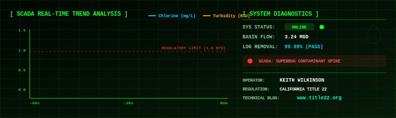

<p align="center">
  
</p>

<p align="center">
  <strong>An interactive, arcade-style drinking water disinfection simulator.</strong><br>
  <em>Designed for entertainment and regulatory playfulness by <strong>Keith Wilkinson</strong>, writer of the water infrastructure blog <a href="https://www.title22.org">www.title22.org</a>.</em>
</p>

<p align="center">
  <a href="https://boxwrench.github.io/Diss-N-Fex/">
    
  </a>
</p>

<p align="center">
  
  
  
</p>

---

## ⚡ SCADA Live Telemetry Feed
The contact basin is currently receiving raw water. Operator login verified. Standard operating criteria defined under **California Code of Regulations (CCR) Title 22 §64449**.

<p align="center">
  
</p>

---

## 💧 The Premise

Welcome to **Diss N Fex**! You are a certified Water Treatment Plant Operator controlling a highly advanced, automated disinfection rig (manifested as an **Operator Cloud**). 

Your objective is simple: **prevent waterborne pathogens from sneaking through the contact basin and entering the clearwell**. 

Instead of traditional arcade enemies, you are fighting microscopic impurities, bacteria, viruses, and cysts. Keep your chemical residual stable, manage filter turbidity, audit clearwell contact times, and defend the public from the dreaded **Superbug King**!

---

## 🎮 How to Operate the Rig

Operate your SCADA cloud terminal using the following controls:

| Input Control | Operation Protocol | Treatment Barrier Action |
| :--- | :--- | :--- |
| **`W` / `A` / `S` / `D`** (or **`Arrows`**) | **Rig Guidance** | Fly the cloud left, right, up, and down the basin. |
| **`Spacebar`** (Hold) | **Chlorine Spray (Rain)** | Continuously sprays chlorine disinfectant. Essential for basic sanitization. |
| **`E`** (or **`Left-Click`**) | **Ozone Diffuser (Hail)** | Fires heavy ozone hail balls. Excellent for target treatment. |
| **`Q`** (or **`Right-Click`**) | **UV Reactor Pulse (Lightning)** | Discharges a massive ultraviolet pulse dealing high AoE damage. |
| **`F`** | **Filter Vortex (Tornado)** | Triggers a backwash vortex that sweeps up and filters out large pathogen clusters. |
| **`R`** | **Coagulant Injection (Frost)** | Shoots a freeze cone that traps pathogens, causing them to take **1.3x damage** and shatter. |
| **`T`** | **pH Shock Zone (Fog)** | Deploys a fog corridor that slows pathogens by **60%** and multiplies all damage taken by **1.5x**. |

---

## 🔬 Pathogen & Impurity Manifest

As water flow rates change, different pathogens will unlock. Keep an eye on your SCADA alerts to counter their unique characteristics.

<details>
<summary>👁️ Click to view the Microbiological Database</summary>
<br>

| Pathogen Name | Normal Human Form | HP | Special Operational Profile |
| :--- | :--- | :--- | :--- |
| **Bacillus** | Business Man | 1 | Basic rod bacteria. Wiggles its cilia to move at standard speed. |
| **Coccus** | Business Woman | 1 | Standard sphere-shaped bacteria that travels in clusters. |
| **Amoeba** | Tourist | 1 | A slow-moving protozoan that pauses frequently to sample conditions. |
| **Flagellate** | Jogger | 1 | High-mobility organism that zips through the basin. |
| **Endospore** | Raincoat Person | 1 | A dormant bacterial spore. Has **80% resistance** to basic Chlorine Spray! |
| **Biofilm Germ** | Umbrella Person | 1 | Shielded by a protective slime layer that completely blocks chlorine from above. |
| **Protozoan** | Old Lady | 1 | Very slow, ciliated eukaryotic cell. Extremely sensitive to UV pulses. |
| **Budding Yeast** | Dog Walker | 1 | Multiplies by budding. The bud acts as a trailing cell connected by a plasma bridge. |
| **Juggling Virus** | Street Performer | 1 | Stationary capsid. Juggles viral nodes to infect local areas. |
| **Pathogen Cyst** | Construction Worker | 3 | Thick-walled protective cyst. High HP and resists **30%** of chlorine rain. |
| **Biofilm Gladiator** | Riot Police | 4 | Heavy armor plating. Rejects physical forces and shields nearby cells. |
| **Mutator Cell** | Scientist | 1 | Constantly mutates. Highly unstable, coding DNA fragments in real-time. |
| **Superbug King** (Boss) | Mayor / VIP | 500 | Elite boss. Spawns shield protein bodyguards and marches slowly to infect the effluent line. |

</details>

---

## 🧪 Emergency Override Protocols (Secret Combos)

By collecting falling chemical power-ups and storing them in your inventory, you can stack active treatment aids. Triggering specific combinations will activate **Emergency SCADA Override Protocols**—insane screen-clearing effects that completely reset the basin!

<details>
<summary>⚡ Click to unlock the SCADA Secret Combo Formulas</summary>
<br>

1. **`EMERGENCY OVERRIDE` (Ragnarök)**
   * **Formula**: Stack **2x Jar Test Lamps (Aurora)** + **1x Tracer Dye (Rainbow)**.
   * **Result**: Summons Thor, descending to strike down 20 random pathogens with divine lightning bolts while shaking the entire screen.
2. **`FLASH COAGULATION` (Ice Age)**
   * **Formula**: Stack **3x Flash Coagulants (Blizzard)**.
   * **Result**: Instantly freezes all pathogens in the basin, rendering them helpless for a prolonged duration.
3. **`PLANT UPSIZE` (Kaiju Mode)**
   * **Formula**: Stack **2x Oxidant Dose Boosts (Rage)** + **1x Operator Lift (Growth)**.
   * **Result**: Grow your operator cloud to massive proportions for 20 seconds, magnifying the size and damage of all attacks.
4. **`LONG CONTACT HOLD` (Time Stop)**
   * **Formula**: Stack **3x Contact Basin Holds (SlowMo)**.
   * **Result**: Stretches the fabric of time itself, slowing all pathogens to a near-halt (8% speed) while you freely disinfect the pool.
5. **`MOBILE UV LAMP` (EMP)**
   * **Formula**: Stack **2x UV Lamp Drones (Ball Lightning)** + **1x UV Lamp Bank (Chain Lightning)**.
   * **Result**: Spawns an autonomous electrical orb that hunts pathogens across the basin, disabling enemy shields and zapping them for massive damage.
6. **`CLEARWELL SURGE` (Great Flood)**
   * **Formula**: Stack **3x Chlorine Residual Boosts (Rain Boost)**.
   * **Result**: Rises the basin water level, drowning all pathogens caught beneath the waterline.
7. **`CONTACT CASCADE` (Chain Reaction)**
   * **Formula**: Stack **3x UV Lamp Drones (Ball Lightning)**.
   * **Result**: Instantly chains electrical current from pathogen to pathogen, creating a devastating molecular feedback loop.
8. **`DOUBLE TRACER STUDY` (Double Rainbow)**
   * **Formula**: Stack **2x Tracer Dyes (Rainbow)**.
   * **Result**: Lures all pathogens on-screen and spawns 20 extra pathogens immediately into the center of your disinfectant spray.
9. **`BREAKPOINT CHLORINATION` (Toxic Storm)**
   * **Formula**: Stack **3x Breakpoint Chlorine (Acid Rain)**.
   * **Result**: Floods the sky with a toxic green acid rain storm that completely ignores pathogen resistance and melts shielding.
10. **`UV OVERDRIVE` (Tesla Overload)**
    * **Formula**: Stack **3x UV Lamp Banks (Chain Lightning)**.
    * **Result**: Puts the UV generator into overdrive, automatically zapping random pathogens with high-voltage lightning strikes.

</details>

---

## 🛠️ Technology Stack & Execution

This game runs entirely in the browser using raw, native web technologies—no heavy frameworks, bundlers, or servers required.

* **Graphics**: HTML5 Canvas API with dynamic scaling.
* **Physics/State**: Custom 2D collision detection and gravity systems.
* **Audio**: Multi-channel synth sound effects and retro background soundtracks.

### How to Run Locally

1. Clone this repository:
   ```bash
   git clone https://github.com/yourusername/diss-n-fex.git
   ```
2. Navigate to the project directory:
   ```bash
   cd "Diss N Fex"
   ```
3. Open `index.html` directly in your browser, or spin up a local development server for the full audio experience:
   ```bash
   npx http-server ./
   ```

---

## ✍️ About the Author

**Keith Wilkinson** is a veteran water industry professional and treatment plant operator based in California. 

Through his blog, [Title 22 (www.title22.org)](https://www.title22.org), Keith writes about public water systems, federal guidelines, engineering strategies, cybersecurity, and the day-to-day realities of keeping drinking water safe. 

* **Read the Newsletter**: [title22.substack.com](https://title22.substack.com)
* **Check out more projects**: [projects.title22.org](https://projects.title22.org)

---

<p align="center">
  <sub><strong>Disclaimer:</strong> This simulator is for entertainment purposes only. The chemical dosing rates, UV charge times, and weather-based backwashes depicted in this game do not represent actual water engineering calculations or safe drinking water operating parameters. Do not attempt to run a municipal water plant using an Operator Cloud.</sub>
</p>
